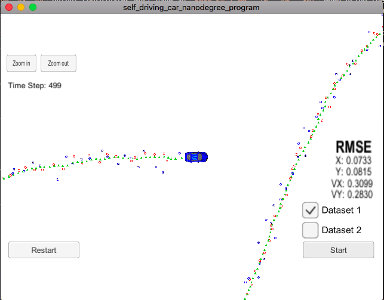
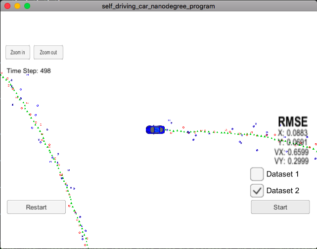
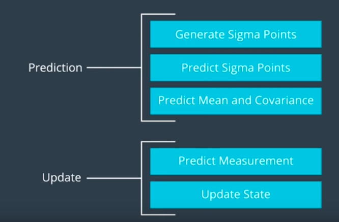

# Unscented Kalman Filter Project

Udacity Self-Driving Car Engineer Nanodegree Program

## Overview

In this project utilize an Unscented Kalman Filter to estimate the state of a moving object of interest with noisy lidar and radar measurements. Passing the project requires obtaining RMSE values that are lower that the tolerance outlined in the project rubric.

This project involves the Term 2 Simulator which can be downloaded [here](https://github.com/udacity/self-driving-car-sim/releases)

This repository includes two files that can be used to set up and intall [uWebSocketIO](https://github.com/uWebSockets/uWebSockets) for either Linux or Mac systems. For windows you can use either Docker, VMware, or even [Windows 10 Bash on Ubuntu](https://www.howtogeek.com/249966/how-to-install-and-use-the-linux-bash-shell-on-windows-10/) to install uWebSocketIO. Please see [this concept in the classroom](https://classroom.udacity.com/nanodegrees/nd013/parts/40f38239-66b6-46ec-ae68-03afd8a601c8/modules/0949fca6-b379-42af-a919-ee50aa304e6a/lessons/f758c44c-5e40-4e01-93b5-1a82aa4e044f/concepts/16cf4a78-4fc7-49e1-8621-3450ca938b77) for the required version and installation scripts.

## Prerequisites

The project requires following packages/dependencies to be installed on system

* cmake >= 3.5
  * All OSes: [click here for installation instructions](https://cmake.org/install/)
* make >= 4.1 (Linux, Mac), 3.81 (Windows)
  * Linux: make is installed by default on most Linux distros
  * Mac: [install Xcode command line tools to get make](https://developer.apple.com/xcode/features/)
  * Windows: [Click here for installation instructions](http://gnuwin32.sourceforge.net/packages/make.htm)
* gcc/g++ >= 5.4
  * Linux: gcc / g++ is installed by default on most Linux distros
  * Mac: same deal as make - [install Xcode command line tools](https://developer.apple.com/xcode/features/)
  * Windows: recommend using [MinGW](http://www.mingw.org/)
* Udacity's Simulator [Download](https://github.com/udacity/self-driving-car-sim/releases)

## Build Steps

Once the install for [uWebSocketIO](https://github.com/uWebSockets/uWebSockets) is complete, the main program can be built and ran by doing the following from the project top directory.

    mkdir build
    cd build
    cmake ..
    make
    ./UnscentedKF

Tips for setting up your environment can be found [here](https://classroom.udacity.com/nanodegrees/nd013/parts/40f38239-66b6-46ec-ae68-03afd8a601c8/modules/0949fca6-b379-42af-a919-ee50aa304e6a/lessons/f758c44c-5e40-4e01-93b5-1a82aa4e044f/concepts/23d376c7-0195-4276-bdf0-e02f1f3c665d)

## Communication with Simulator

Here is the main protcol that main.cpp uses for uWebSocketIO in communicating with the simulator.

    INPUT: values provided by the simulator to the c++ program

    ["sensor_measurement"] => the measurment that the simulator observed (either lidar or radar)

    OUTPUT: values provided by the c++ program to the simulator

    ["estimate_x"] <= kalman filter estimated position x
    ["estimate_y"] <= kalman filter estimated position y
    ["rmse_x"]
    ["rmse_y"]
    ["rmse_vx"]
    ["rmse_vy"]

## Code Style

Please stick to [Google's C++ style guide](https://google.github.io/styleguide/cppguide.html) as much as possible.

## Generating Additional Data

This is optional!

If you'd like to generate your own radar and lidar data, see the
[utilities repo](https://github.com/udacity/CarND-Mercedes-SF-Utilities) for
Matlab scripts that can generate additional data.

## Project Instructions and Rubric

This information is only accessible by people who are already enrolled in Term 2
of CarND. If you are enrolled, see [the project page](https://classroom.udacity.com/nanodegrees/nd013/parts/40f38239-66b6-46ec-ae68-03afd8a601c8/modules/0949fca6-b379-42af-a919-ee50aa304e6a/lessons/c3eb3583-17b2-4d83-abf7-d852ae1b9fff/concepts/f437b8b0-f2d8-43b0-9662-72ac4e4029c1)
for instructions and the project rubric.

## [Rubic](https://review.udacity.com/#!/projects/284/view) Points

### Compiling

* Your code should compile

  Code compiles successfully without any errors with the use of `cmake` and `make`. Detailed steps provided above in `Build Steps`

### Accuracy

* `px, py, vx, vy` output coordinates must have an `RMSE <= [.09, .10, .40, .30]` when using the file: `obj_pose-laser-radar-synthetic-input.txt`, which is the same data file the simulator uses for Dataset 1.

  Unscented Kalman Filter accuracy at end of path for given two datasets are as given below which meets the requirement of `RMSE <= [.09 .10 .40 .30]` when using file `obj_pose-laser-radar-synthetic-input.txt` which is same data file as `Dataset 1`. Although I have tested with `Dataset 2` and that meets requirement too:

  **EKF RMSE values**

  | Dataset | RMSE [X Y VX VY]              |
  | ------- | ----------------------------- |
  | 1       | [0.0964 0.0854 0.4154 0.4316] |
  | 2       | [0.0726 0.0965 0.4219 0.4937] |

  **UKF RMSE values**

  | Dataset | RMSE [X Y VX VY]              |
  | ------- | ----------------------------- |
  | 1       | [0.0964 0.0854 0.4154 0.4316] |
  | 2       | [0.0726 0.0965 0.4219 0.4937] |

  *Result from Dataset 1*

  

  *Result from Dataset 2*

  

### Follows the Correct Algorithm

* Your Sensor Fusion algorithm follows the general processing flow as taught in the preceding lessons.

  I have used `Unscented Kalman Filter` to update measurements matricies for `LIDAR/LASER` and/or `RADAR` inputs by computing Mean and Covariance matricies for object. As taught in lesson, this is being done with following steps:

  

* Your Kalman Filter algorithm handles the first measurements appropriately.

  I have initialized object positions for UKF measurement matrix from the most recent data received. For `RADAR` data inputs, I have first converted them to `Cartesian` coordinate system from the `Polar` Coordinate system.

  Implementation can be found in `src/ukf.cpp` (line 111-166).

* Your Kalman Filter algorithm first predicts then updates.

  I have updated State trasition matrix and process covariance matrix, based on the `timestamp` difference in seconds, prior to performing predictions. (Implementation at `src/ukf.cpp` line 172-187).

  Here, update happens differently for `RADAR` and `LIDAR/LASER` data input. Implementation for `UpdateLidar()` at line 226-324 and `UpdateRadar()` at line 330-435.

* Your Kalman Filter can handle radar and lidar measurements.

  I have implemented Kalman Filter to update for `RADAR` as well as `LIDAR/LASER` data points and predict object position and velocity based on both data points or one of them.

### Code Efficiency

* Your algorithm should avoid unnecessary calculations.

  Algorithm computes with minimal computational cost possible.
